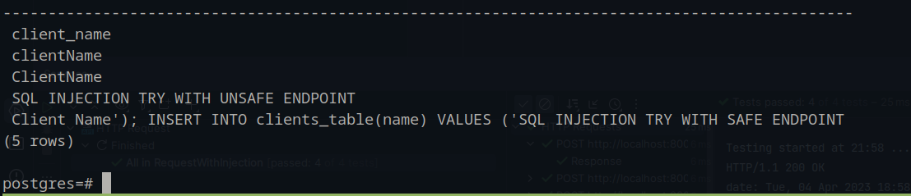

# SQL injection example

- ### Start service:
```shell
docker compose up
```

- ### Connect to db with psql:
```shell
docker compose exec postgres psql -U postgres
```

- ### Create table (run this in psql):
```shell
CREATE TABLE clients_table(
    name TEXT
);
```

- ### Run `request.http` as you can, maybe with PyCharm


- ### Check created rows:
```shell
SELECT * FROM clients_table;
```

